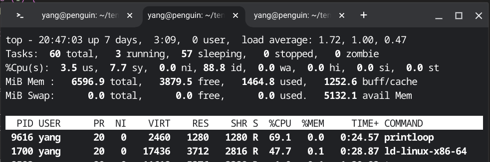
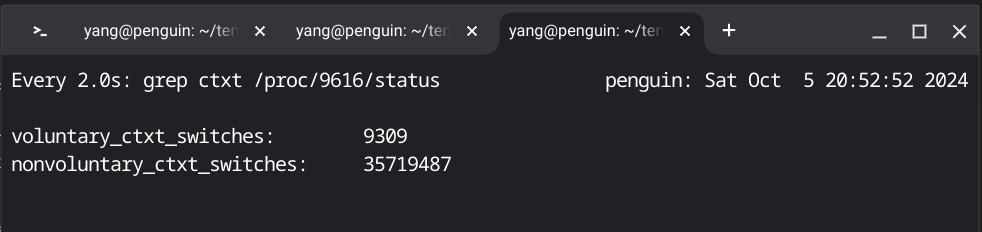
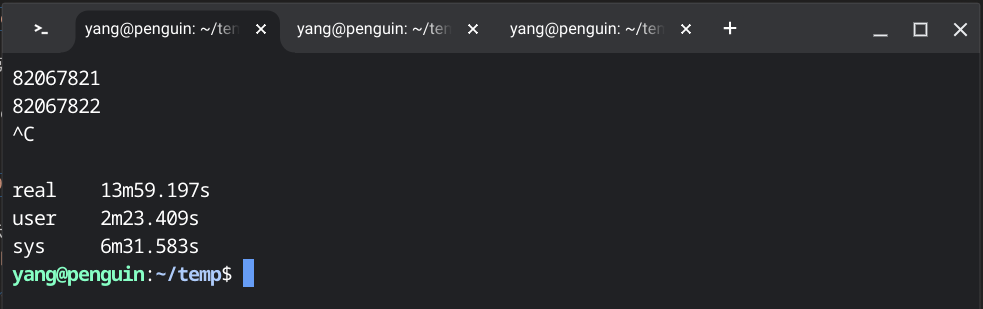

+++
title = '阻塞'
date = 2024-09-28T17:41:46+08:00
draft = false
+++

## printf会阻塞吗？

操作系统教科书说，进程在进行输入输出操作时，因为外设速度和CPU比起来较慢，有可能进入阻塞状态。
这点在进行输入操作时表现得比较明显。假设程序调用`scanf`从键盘读取数据，如果用户尚未输入，
那么程序就会一直阻塞在那里等待用户输入。但是，当程序进行输出操作，比如调用`printf`输出信息时会阻塞吗？
从用户的感受看，信息输出的速度很快，我们并不确信程序在输出时有没有阻塞。

这里，我们就来审视一下这个问题。先从简单的场景开始，熟悉一下我们用到的工具。

假设有如下一个程序`loop.c`：
```C
int main()
{
    while (1);
    return 0;
}

```

编译并运行：
```
gcc loop.c -o loop
time ./loop
```

这里用`time`这个工具来测量程序运行时时间方面的统计信息。因为这个程序里只有一个死循环，
而且没有输出，所以，屏幕上没有任何反馈，这是正常现象。

打开另一个终端窗口，执行以下命令：
```
top
```

终端中会显示出类似下面的信息：


可以看出，`loop`这个进程的`CPU`占用率是100%。你看到的数据或许不是100%，
但也差不多接近100%。在一个负载较轻的系统中，这符合预期：`loop`这个程序一直在循环里空转，
几乎一直处于运行状态。

现在打开第三个终端窗口，在其中执行如下命令：
```
watch grep ctxt /proc/3573/status
```

命令中的`3573`对应`top`窗口中显示的`loop`的进程号。

终端中显示出类似下面的信息：


终端中显示了两个数据，一个是自愿进程切换次数，一个是非自愿进程切换次数。
可以看出，`loop`的自愿切换次数是0，非自愿切换次数是955。综合`top`窗口和`watch`窗口中的信息可以得出结论：
`loop`进程一直在忙，从未阻塞——自愿切换次数为0。虽然有将近1千次非自愿切换，但`CPU`占用率为100%或接近100%，
说明`loop`处于就绪态的时间极短：`loop`被迫切换出`CPU`后，操作系统很快又为它分配了`CPU`。

现在回到第一个终端窗口，按`Ctrl+C`终止`loop`，终端中显示出类似下面的信息：


可以看出，`loop`持续运行了6分46秒，其中在用户态运行了6分45秒，在核心态运行了0.176秒。
核心态加用户态运行时间略小于持续运行时间，说明`loop`在就绪态的时间也很短，不足1秒。

现在把程序修改一下，并保存为`printfloop.c`：
```C
#include <stdio.h>

int main()
{
    int i = 0;
    while (1) {
        printf("%d\n", i++);
    }
    return 0;
}

```

编译并运行：
```
gcc printloop.c -o printloop
time ./printloop
```

可以看出，程序一直在疯狂输出。

在执行`top`命令的终端窗口中：


`printloop`的`CPU`占有率是69.1%，离100%有相当的距离。

现在打开第三个终端窗口，在其中执行如下命令：
```
watch grep ctxt /proc/9616/status
```

命令中的`9616`对应`top`窗口中显示的`printloop`的进程号。

终端中显示出类似下面的信息：


可以看出，`printloop`的自愿切换次数是9309，非自愿切换次数是35719487。
自愿切换次数非零，表示`printloop`多次自愿放弃`CPU`进入了阻塞状态。
`top`窗口中显示`printloop`的`CPU`占用率明显不足100%也印证了这一点。

现在回到第一个终端窗口，按`Ctrl+C`终止`printloop`，终端中显示出类似下面的信息：


可以看出，`printloop`持续运行了13分59秒，其中在用户态运行了2分23秒，在核心态运行了6分31秒。
运行在用户态的时间和运行在核心态的时间相加明显少于程序持续运行的时间，结合系统负载较轻的事实，
可以判定，这其中的差值大约就是`printloop`阻塞的时间。

结论：`printf`会导致程序阻塞，但不是每次都会。
